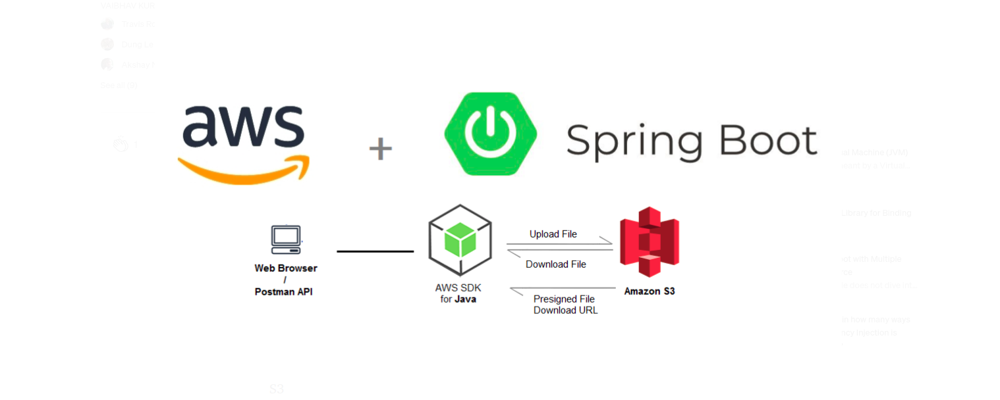

# FileUpload
File Upload with GRPC spring boot and AWS S3

## Steps to Follow
* First create a s3 bucket in AWS managment console.
* Then create a database called `filestorage` in postgresql
* Then start the spring boot server using this command `./gradlew clean build bootRun`
* Refer the below endpoints
    * http://localhost:8080/files/upload         `POST` 
    * http://localhost:8080/files/download/{id} `GET`
    * http://localhost:8080/files/delete/{id}  `DELETE`

### Todo
* Implement the above steps using GRPC....